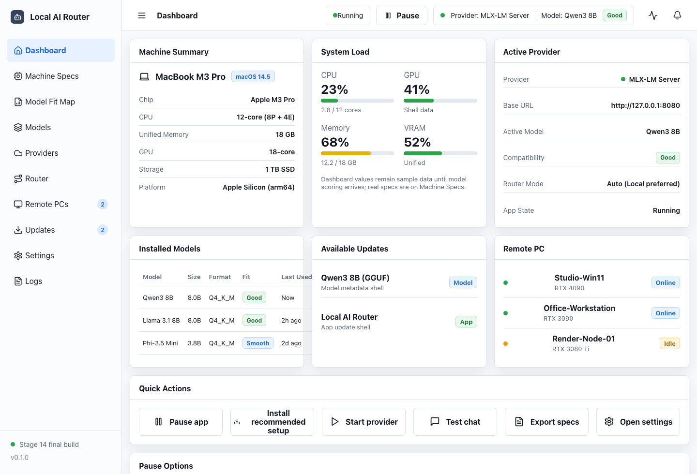
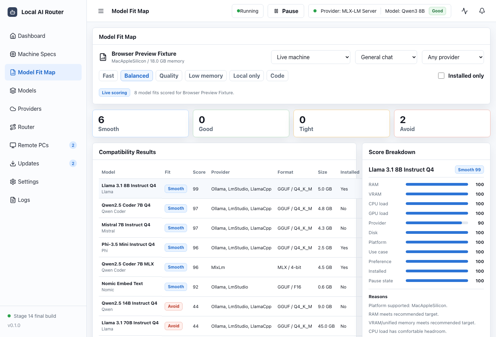
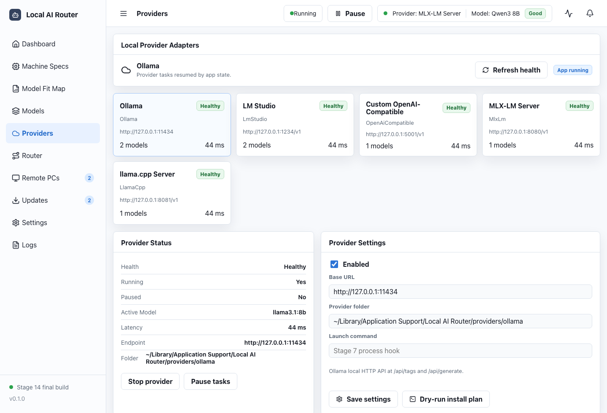
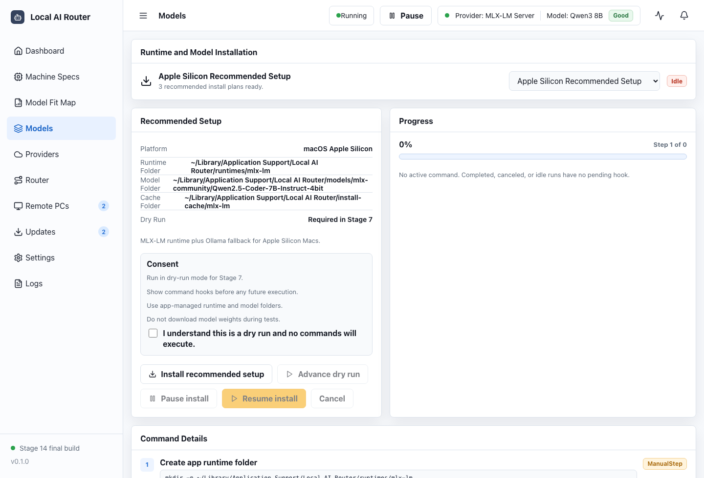
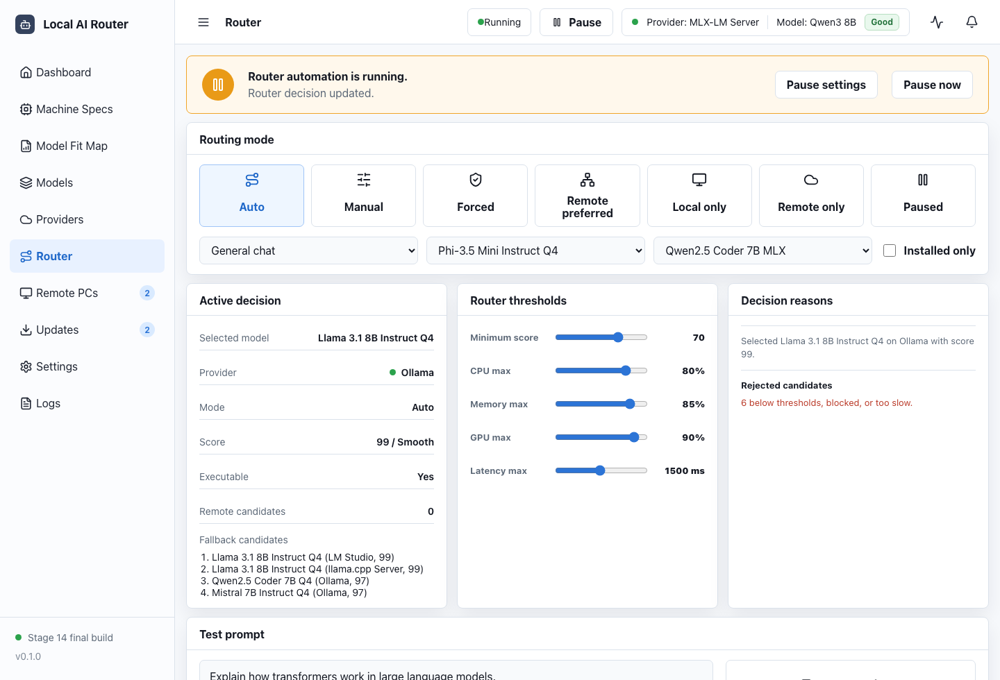
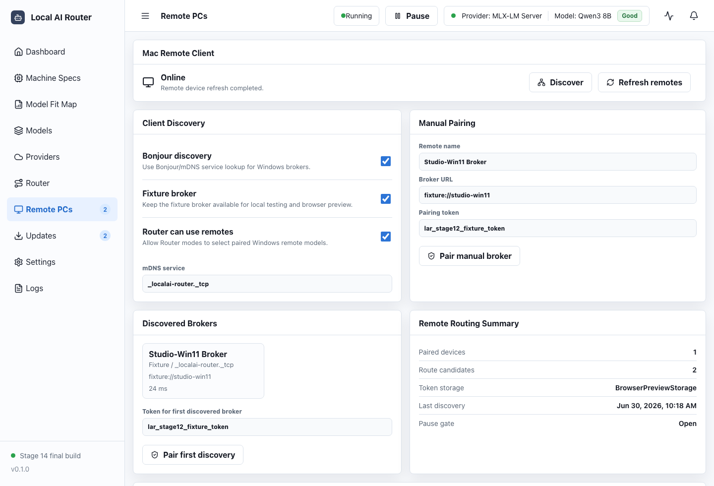
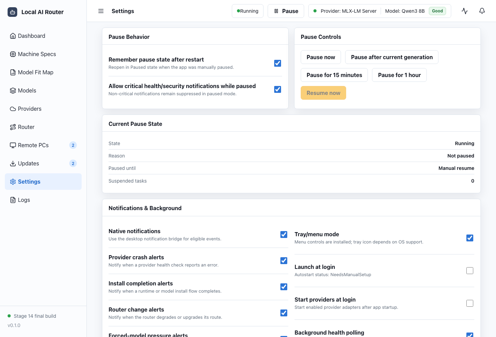
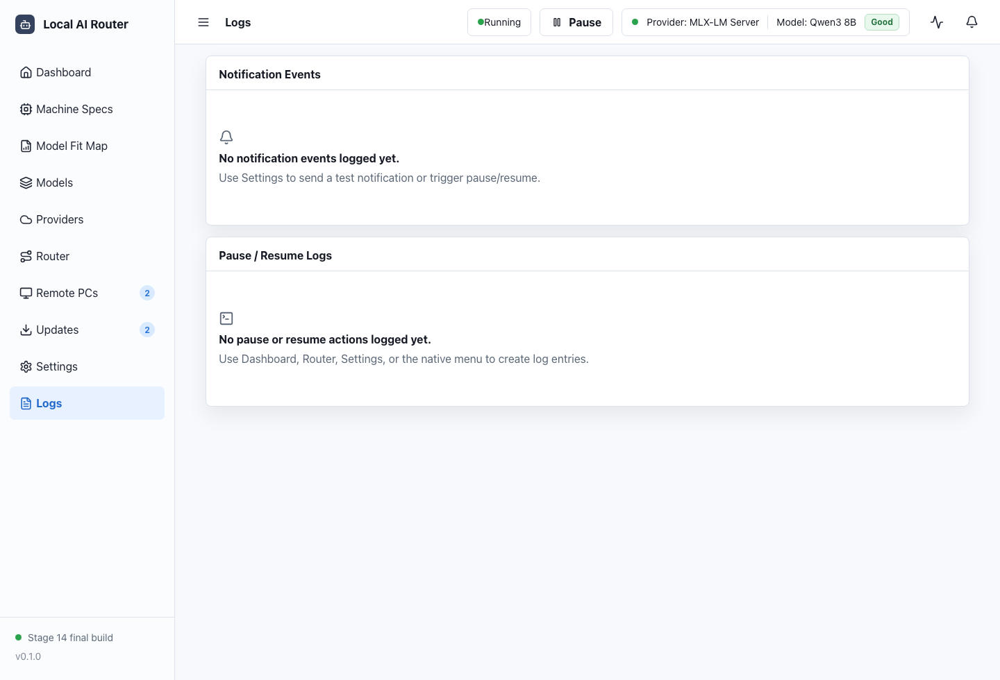

# User Guide

This guide is organized by task. For end-to-end examples, read
[Scenario Walkthroughs](SCENARIOS.md). For setup behavior, read
[Regular vs Dry-Run Methods](REGULAR_VS_DRY_RUN.md).

## First Launch

| Callout | What to use |
| --- | --- |
| 1 | Left navigation opens every major workflow. |
| 2 | The top state badge shows whether automation is running or paused. |
| 3 | Dashboard cards summarize machine, provider, router, and remote status. |
| 4 | Quick actions jump to common setup tasks. |

1. Open Local AI Router.
2. Confirm the state badge says `Running`.
3. Open **Machine Specs** and refresh the live hardware probe.
4. Export specs if you want a record for troubleshooting.

Expected result: the app shows your OS, CPU, memory, GPU, storage, provider
ports, and current load.

## Choose A Compatible Model

| Callout | What to use |
| --- | --- |
| 1 | Hardware fixture/live profile selector controls the scoring context. |
| 2 | Filters narrow by use case, provider, preference, and installed status. |
| 3 | Compatibility labels explain whether a model is Smooth, Good, Tight, or Avoid. |
| 4 | Score breakdown explains the selected model result. |

1. Open **Model Fit Map**.
2. Select your hardware profile or use live hardware.
3. Choose a use case such as chat, coding, or reasoning.
4. Review labels:
   - `Smooth`: preferred.
   - `Good`: acceptable.
   - `Tight`: may work with pressure.
   - `Avoid`: likely unsupported or too heavy.

Expected result: the model table explains why each model fits or does not fit.

## Connect Local Providers

| Callout | What to use |
| --- | --- |
| 1 | Provider cards show health, model counts, and pause state. |
| 2 | Provider settings hold the local base URL and enablement state. |
| 3 | Model listing and test chat verify provider connectivity. |
| 4 | Provider logs show recent checks and actions. |

1. Install and start a provider outside the app: Ollama, LM Studio, MLX-LM, or
   an OpenAI-compatible local server.
2. Open **Providers**.
3. Refresh health.
4. Update base URLs if your provider does not use the default local port.
5. Run a small test chat from the provider panel.

Expected result: a healthy provider lists models and can answer a tiny test
prompt. If a provider is stopped, start it outside the app or use the provider
start controls where available.

## Use The Dry-Run Installer

| Callout | What to use |
| --- | --- |
| 1 | Setup plan selector chooses Apple Silicon, Intel Mac, or Windows plan. |
| 2 | Folder rows show where future runtime/model/cache files would live. |
| 3 | Consent checkbox is required before dry-run execution. |
| 4 | Command details show exactly what would run in a future live installer. |

1. Open **Models**.
2. Choose a recommended setup plan.
3. Read the runtime, model, and cache folders.
4. Confirm the dry-run consent checkbox.
5. Click **Install recommended setup**.
6. Use **Advance dry run** to step through the command plan.

Expected result: commands and logs are shown, but no runtime or model weights
are downloaded.

Dry-run means the app previews the setup plan without changing package managers,
installing runtimes, or downloading model weights. Regular/live provider checks
are different: they contact providers you already installed and started outside
the app.

## Route A Test Prompt

| Callout | What to use |
| --- | --- |
| 1 | Routing mode chooses Auto, Manual, Forced, Local only, Remote preferred, or Remote only. |
| 2 | Active decision shows the selected provider/model and whether it is executable. |
| 3 | Thresholds and reasons explain why the route was selected or rejected. |
| 4 | Test prompt sends a small verification request through the selected route. |

1. Open **Router**.
2. Choose Auto, Manual, Forced, Local only, Remote preferred, Remote only, or
   Paused.
3. Review the selected route, candidate list, and decision reasons.
4. Run the test prompt.

Expected result: the router explains which provider/model was selected and why.

## Use A Windows Remote Broker

| Callout | What to use |
| --- | --- |
| 1 | Mac Remote Client controls discovery, refresh, manual pairing, and fixed address pairing. |
| 2 | Remote Routing Summary shows whether remotes can be used by Router. |
| 3 | Paired Remote Devices shows health, specs, models, and latency. |
| 4 | Windows Remote Provider Broker controls LAN sharing, pairing codes, and endpoint previews. |

1. On the Windows PC, open **Remote PCs**.
2. Enable LAN sharing.
3. Choose a bind host and port.
4. Start the broker.
5. Create a pairing code.
6. On the Mac, open **Remote PCs** and pair by Bonjour discovery, manual URL, or
   fixed broker address.

Expected result: the Mac shows remote specs, provider health, remote models, and
route candidates.

## Pin A Fixed Broker Address

Use this when Bonjour discovery is unreliable or the Windows PC IP changes.

1. Reserve the Windows PC IP in your router or set a static IP in Windows.
2. Open **Remote PCs** on the Mac.
3. Enable **Use fixed broker address**.
4. Enter a broker name and URL, for example `http://192.168.1.50:17640`.
5. Enable **Prefer fixed address over Bonjour** if this should be the primary
   remote connection.
6. Click **Pair fixed address** with a valid pairing token/code.
7. Or click **Discover** to list the fixed broker as a stable candidate before
   Bonjour/fixture results.

Expected result: the fixed broker appears as a stable discovery candidate and is
used before dynamic Bonjour results when preferred.

## Pause And Resume

| Callout | What to use |
| --- | --- |
| 1 | Notification toggles control which background events are surfaced. |
| 2 | Background toggles control autostart and health polling behavior. |
| 3 | Pause settings preserve or clear paused state after restart. |
| 4 | Logs record pause, notification, provider, update, and router events. |

Use pause mode when you want all automation to stop changing state.

Paused mode blocks or suspends routing changes, update checks, installer runs,
provider background tasks, remote discovery, and broker behavior according to
the selected broker pause policy.

## Troubleshooting

- Provider not found: confirm the provider is running and the base URL is
  correct.
- Remote broker not found: use fixed broker address instead of Bonjour.
- Pairing fails: create a fresh pairing code and confirm the Mac can reach the
  Windows broker URL.
- Remote route unavailable: refresh remotes, verify the broker token was not
  revoked, and check pause mode.
- App cannot install a model: Stage 14 installer flows are dry-run only.
